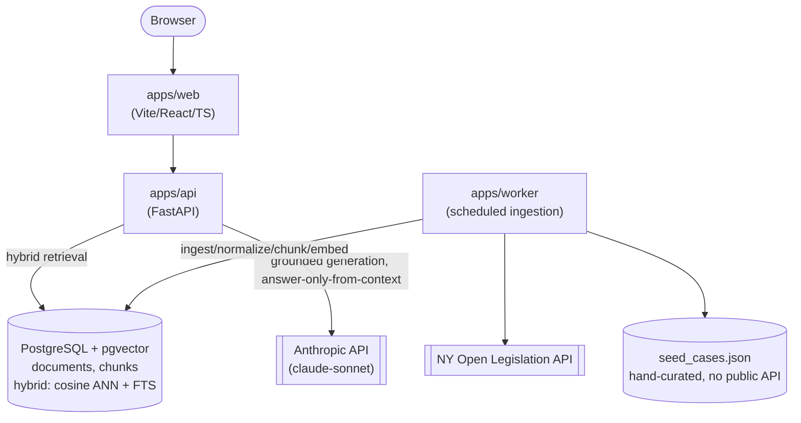
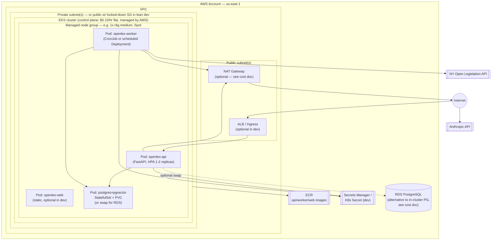
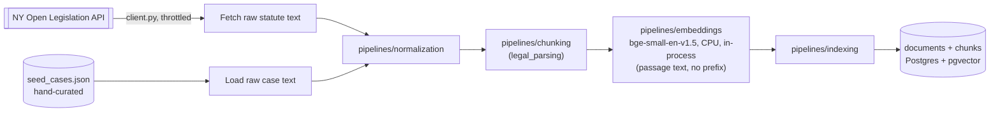
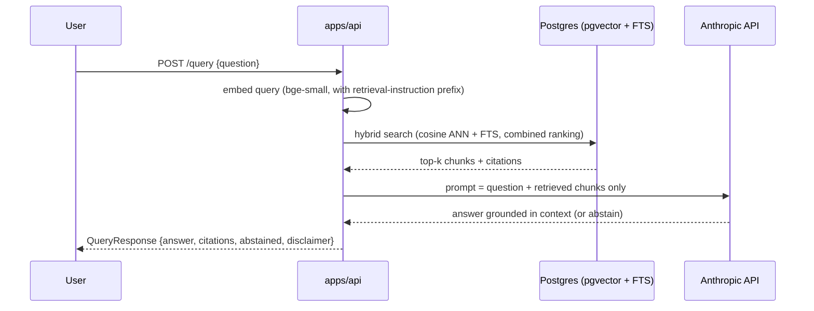

# Architecture diagrams

Companion to [`aws-eks-cost-estimate.md`](./aws-eks-cost-estimate.md) and
[`mlops-guide.md`](./mlops-guide.md). These render as diagrams directly on GitHub (Mermaid).
Reflects the target architecture from
`docs/decisions/0001-monorepo-restructure.md` plus the AWS/EKS deployment layer, which does
not exist yet (see "Current state" in the root `CLAUDE.md`) — this is where things go once
`infra/kubernetes` and `infra/terraform` stop being placeholders.

## 1. Service topology (logical, environment-agnostic)

## 2. AWS / EKS deployment topology (target — not built yet)

Notes:
- No GPU nodes anywhere — `BAAI/bge-small-en-v1.5` embeds on CPU in-process in `apps/api`/
  `apps/worker` (see `ml/model_cards/bge-small-en-v1.5.md`); there is no standalone
  model-serving component (confirmed in `docs/decisions/0001-monorepo-restructure.md`).
- `NAT`, `ALB`, and `RDS` are drawn as optional/alternative because the cost doc recommends
  cutting them for a lean dev environment — see that doc for the tradeoffs.

## 3. Ingestion pipeline data flow

## 4. Query-time sequence (grounded answer contract)

Every `QueryResponse` includes `citations`, `abstained`, and the fixed `DISCLAIMER` string —
see `packages/legal_models/src/legal_models/schemas.py` and the `grounded-answer-contract`
skill. Retrieval and generation code do not exist yet; this is the target flow.
