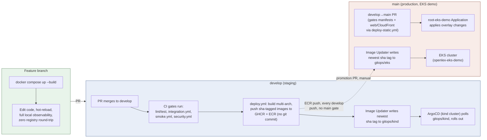
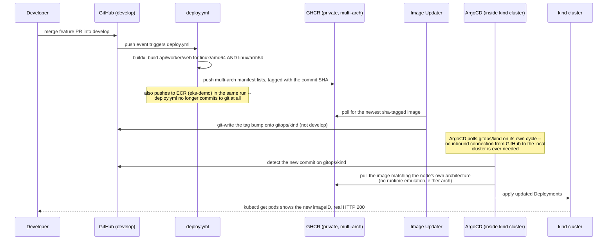

# Dev workflow: docker-compose → kind → CI/CD

How day-to-day work actually flows through this repo's three environments, why it's built
this way, and an honest look at what it costs. Companion to
[`architecture-diagrams.md`](./architecture-diagrams.md) (system topology) and
[`mlops-guide.md`](./mlops-guide.md) (pipeline/cost reasoning) — this doc is about the
*process* of shipping a change, not the system itself.

Design source: `docs/superpowers/specs/2026-07-14-phase6-cicd-hardening-design.md`. Built and
live-verified 2026-07-14 (including two real bugs found only once the full pipeline actually
ran end-to-end — see "What this caught" below).

## The three environments

| Environment | Branch | Trigger | Purpose | Stack |
|---|---|---|---|---|
| Local dev | any feature branch | manual (`docker compose up`) | Fast iteration — edit code, see it run, no rebuild/reload cycle | `db`, `api`, `worker`, `web` + a lightweight observability subset (OTel Collector, Prometheus, Grafana, single Jaeger trace backend) |
| Staging | `develop` | automatic (on push) | GitOps-realistic environment — proves the real build→registry→delivery pipeline works | kind + ArgoCD, full observability stack (Prometheus, Grafana, Tempo, Jaeger, Loki, OTel Collector, Alertmanager) |
| Production | `main` | split — see below | EKS demo cluster (`openlex-eks-demo`), live since 2026-07-15 | EKS + ArgoCD, full observability stack |

> **Updated 2026-07-16 — this row was wrong when first written.** EKS was Phase-7/"not built" at
> the time this doc was drafted; it's since been stood up and is running for real
> (`docs/decisions/0007-argocd-image-updater.md`, `docs/infrastructure/eks-argocd-bootstrap.md`).
> Promotion to it is **not actually one deliberate gate** — it's two independent mechanisms with
> different cadences:
> - **API/worker containers auto-promote on every `develop` push, with no `main` gate at all.**
>   `deploy.yml` pushes sha-tagged images to ECR on every `develop` push (not just GHCR); Argo CD
>   Image Updater on the EKS cluster watches ECR with `update-strategy: newest-build` and
>   `allow-tags: regexp:^[0-9a-f]{40}$`, and git-writes the newest tag onto `gitops/eks`
>   (`infra/argocd/apps/eks-demo/imageupdater-openlex.yaml`) — same cadence as staging, whether or
>   not that commit ever reaches `main`.
> - **Manifests/overlays and the web/CloudFront static site *do* require a real `main` promotion.**
>   `root-eks-demo` tracks `main` for `infra/argocd/apps/eks-demo`, and `deploy-static.yml` only
>   triggers `on: push: branches: [main]`. See the `eks-platform-ops` skill for operating this
>   cluster day-to-day (context pinning, `gitops/eks` delivery, ArgoCD selfHeal).

## What actually happens when you merge to `develop`

Nothing here is simulated — every arrow above was watched happening for real against the
actual repo and cluster, not just described from the design. (The original run this diagram
documented predates the switch to Image Updater write-back and the ECR/EKS leg — see the
"Bot-commit noise" tradeoff below for why the commit moved off `develop`.)

## The day-to-day cheat sheet

- **Writing/iterating on code:** `docker compose up --build`. This is the primary loop — fast,
  free, full trace/metric visibility via the local OTel Collector + Prometheus + Grafana +
  Jaeger, no image push/pull round-trip.
- **Want to see it in the GitOps-realistic environment without waiting on CI:**
  `scripts/kind/load-images.sh` (build + `kind load docker-image`, unchanged, still instant)
  then `scripts/kind/use-local-images.sh` to point the kind overlay at those local tags —
  deliberately **never committed**; `git checkout -- infra/kubernetes/overlays/kind/kustomization.yaml`
  reverts it.
- **Shipping something real:** open a PR against `develop`, not `main`. CI runs `api.yml`/
  `pipelines.yml`/`web.yml` (lint+test), `integration.yml` (real Postgres), `smoke.yml`
  (real login→query→cited-answer), `security.yml` (dependency audit, secret scan). Merging
  triggers `deploy.yml` automatically — no manual deploy step exists or is needed.
- **Promoting to EKS:** open a `develop → main` PR (never a feature branch straight into
  `main` — see `CLAUDE.md`'s Git workflow section). This is what gates manifest/overlay
  changes and the web/CloudFront static deploy. It does **not** gate api/worker containers —
  those auto-promote to EKS from every `develop` push regardless (see the Production row
  above). Operating the EKS cluster itself (context pinning, `gitops/eks` delivery, ArgoCD
  selfHeal) is covered by the `eks-platform-ops` skill, not this doc.

## What this caught (the honest case for doing it this way)

This pipeline was built, merged, and then actually exercised for real the same day — and it
immediately found two genuine bugs that no amount of code review or per-task testing would
have caught, because they only exist at the seam between two systems:

1. **`infra/argocd/root-apps/root-kind.yaml`** — the App-of-Apps root one directory above the
   9 retargeted child Applications — was itself still pinned to `main`. ArgoCD's `selfHeal`
   was silently reverting the `develop` retarget back to `main` on every reconcile. Invisible
   in any diff review; only surfaced by watching a real sync cycle.
2. **Multi-arch mismatch**: GitHub's runners are `linux/amd64`; this project's kind cluster
   (Apple Silicon) is `linux/arm64`. The first real `deploy.yml` run pushed amd64-only images,
   and `apps/web` crash-looped under QEMU runtime emulation (`apps/api`/`apps/worker`, pure
   Python, tolerated the same emulation *silently* — same root cause, only one visible
   symptom). Only found by watching the actual pod come up and crash.

Neither of these would show up in `docker-compose`-only testing, or in a CI pipeline that
stops at "the build succeeded." They only exist because the pipeline actually runs against a
real, separate cluster with real, separate architecture — which is the entire point.

## Tradeoffs — is this the right amount of process?

**What this buys you:**
- A real, load-bearing GitOps loop (not a diagram) — the kind of thing that's genuinely hard
  to fake in an interview/portfolio context, because a fake version doesn't produce real bugs
  like the two above.
- The fast local loop (`docker-compose`) is fully preserved, not sacrificed for the sake of
  "doing GitOps properly" — day-to-day iteration speed didn't get worse.
- Real registry auth, real multi-arch builds, real branch-based environment promotion — all
  patterns that transfer directly to a real team's setup, not POC-only shortcuts.

**What it costs:**
- **Bot-commit noise, now on `gitops/*` not `develop`**: this used to land on `develop` itself
  (every merge produced a human-merge commit + a `deploy.yml` tag-bump). That's fixed —
  `deploy.yml` no longer commits at all; Argo CD Image Updater git-writes tag bumps onto
  `gitops/kind`/`gitops/eks` instead, keeping `develop`/`main` code-only. The noise didn't
  disappear, it moved to branches nobody reads day-to-day — but see the
  `eks-platform-ops`/`local-environment` skills: those branches drift fast and must be reset
  from `origin`, not trusted locally, before you touch them.
- **Build time**: multi-arch builds are meaningfully slower than single-arch — the QEMU leg of
  the api/worker builds (heavy Python deps: torch, sentence-transformers) took the bulk of a
  ~6.5-minute total run, live-measured. Single-arch would be roughly half that.
- **A manual, local-only credential bootstrap step** (`scripts/kind/ghcr-pull-secret-bootstrap.sh`)
  is required once per machine before the kind cluster can pull the now-private GHCR images —
  one more thing a new contributor has to know about and do.
- **Two branches to keep straight, and the promotion split is easy to misread**: `develop` vs
  `main` — and `main` gates manifests/overlays and the web/CloudFront static site, but *not*
  the API/worker containers, which auto-promote to EKS straight from `develop`'s ECR pushes.
  A contributor who assumes `main` is the single production gate will be surprised that an
  unreviewed `develop` commit is already running in the EKS pods.
- **More moving parts overall** than a single-cluster, single-branch setup: ArgoCD, an
  App-of-Apps root, a registry, a bot-commit loop, ArgoCD's own cache-staleness quirks
  (observed live this session — a hard-refresh was needed twice to get ArgoCD to actually pick
  up new commits despite `sync.revision` appearing to update). Each of these is a thing that
  can silently drift or need a manual nudge.

**Verdict:** justified *for this project's actual purpose* (demonstrating real SRE/platform
engineering practice — see `CLAUDE.md`'s "Why this project exists"), where the operational
rigor and the bugs it surfaces are themselves the point. For a project whose goal was just
"ship the app," this would be real overkill — a single environment with a simpler manual
deploy script would get the same app running with a fraction of the moving parts, and none of
`develop`/`main`'s branch-discipline overhead would be worth carrying for a solo contributor.
(Originally written when EKS was Phase-7/hypothetical; now that it's a live second
environment, the branch discipline earns its keep, but the container-promotion gap noted above
is a real gap worth closing, not a documentation nit — `main` reads as the production gate and
currently isn't one for images.)
