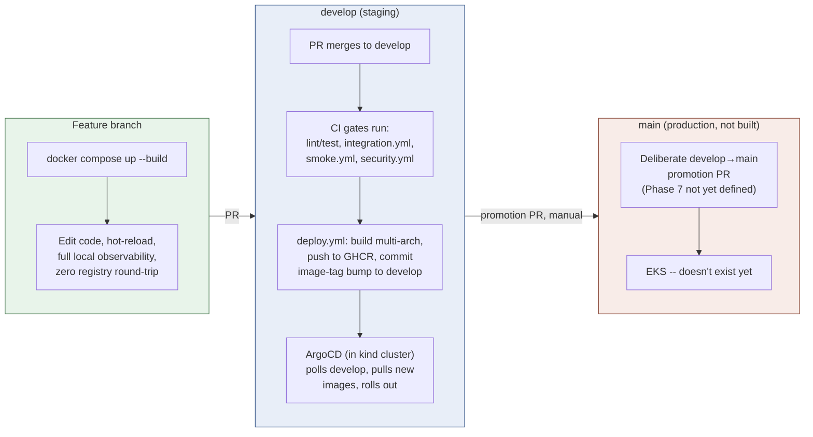
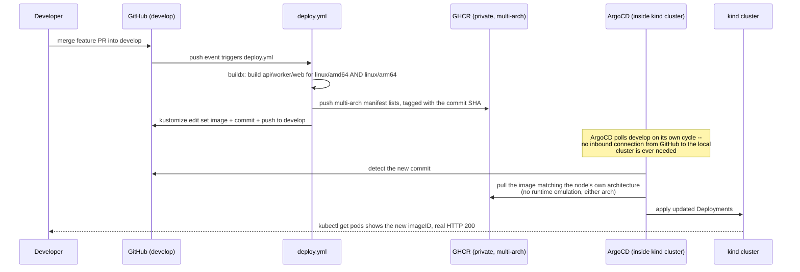

# Dev workflow: docker-compose → kind → CI/CD

How day-to-day work actually flows through this repo's three environments, why it's built
this way, and an honest look at what it costs. Companion to
[`architecture-diagrams.md`](./architecture-diagrams.md) (system topology) and
[`mlops-guide.md`](./mlops-guide.md) (pipeline/cost reasoning) — this doc is about the
*process* of shipping a change, not the system itself.

Design source: `docs/superpowers/specs/2026-07-14-phase6-cicd-hardening-design.md`. Built and
live-verified 2026-07-14 (including two real bugs found only once the full pipeline actually
ran end-to-end — see "What this caught" below).

## The three environments

| Environment | Branch | Trigger | Purpose | Stack |
|---|---|---|---|---|
| Local dev | any feature branch | manual (`docker compose up`) | Fast iteration — edit code, see it run, no rebuild/reload cycle | `db`, `api`, `worker`, `web` + a lightweight observability subset (OTel Collector, Prometheus, Grafana, single Jaeger trace backend) |
| Staging | `develop` | automatic (on push) | GitOps-realistic environment — proves the real build→registry→delivery pipeline works | kind + ArgoCD, full observability stack (Prometheus, Grafana, Tempo, Jaeger, Loki, OTel Collector, Alertmanager) |
| Production | `main` | manual, deliberate promotion (**not yet defined** — Phase 7) | Reserved for a real cloud environment | EKS (Phase 7 scope, not built) |

## What actually happens when you merge to `develop`

Nothing here is simulated — every arrow above was watched happening for real against the
actual repo and cluster, not just described from the design.

## The day-to-day cheat sheet

- **Writing/iterating on code:** `docker compose up --build`. This is the primary loop — fast,
  free, full trace/metric visibility via the local OTel Collector + Prometheus + Grafana +
  Jaeger, no image push/pull round-trip.
- **Want to see it in the GitOps-realistic environment without waiting on CI:**
  `scripts/kind-load-images.sh` (build + `kind load docker-image`, unchanged, still instant)
  then `scripts/use-local-images.sh` to point the kind overlay at those local tags —
  deliberately **never committed**; `git checkout -- infra/kubernetes/overlays/kind/kustomization.yaml`
  reverts it.
- **Shipping something real:** open a PR against `develop`, not `main`. CI runs `api.yml`/
  `pipelines.yml`/`web.yml` (lint+test), `integration.yml` (real Postgres), `smoke.yml`
  (real login→query→cited-answer), `security.yml` (dependency audit, secret scan). Merging
  triggers `deploy.yml` automatically — no manual deploy step exists or is needed.
- **`main`:** don't target it. There's no CI wired to it, no environment it deploys to yet, and
  no defined promotion criteria — it exists as a placeholder boundary for Phase 7, not
  something to open PRs against today.

## What this caught (the honest case for doing it this way)

This pipeline was built, merged, and then actually exercised for real the same day — and it
immediately found two genuine bugs that no amount of code review or per-task testing would
have caught, because they only exist at the seam between two systems:

1. **`infra/argocd/root-apps/root-kind.yaml`** — the App-of-Apps root one directory above the
   9 retargeted child Applications — was itself still pinned to `main`. ArgoCD's `selfHeal`
   was silently reverting the `develop` retarget back to `main` on every reconcile. Invisible
   in any diff review; only surfaced by watching a real sync cycle.
2. **Multi-arch mismatch**: GitHub's runners are `linux/amd64`; this project's kind cluster
   (Apple Silicon) is `linux/arm64`. The first real `deploy.yml` run pushed amd64-only images,
   and `apps/web` crash-looped under QEMU runtime emulation (`apps/api`/`apps/worker`, pure
   Python, tolerated the same emulation *silently* — same root cause, only one visible
   symptom). Only found by watching the actual pod come up and crash.

Neither of these would show up in `docker-compose`-only testing, or in a CI pipeline that
stops at "the build succeeded." They only exist because the pipeline actually runs against a
real, separate cluster with real, separate architecture — which is the entire point.

## Tradeoffs — is this the right amount of process?

**What this buys you:**
- A real, load-bearing GitOps loop (not a diagram) — the kind of thing that's genuinely hard
  to fake in an interview/portfolio context, because a fake version doesn't produce real bugs
  like the two above.
- The fast local loop (`docker-compose`) is fully preserved, not sacrificed for the sake of
  "doing GitOps properly" — day-to-day iteration speed didn't get worse.
- Real registry auth, real multi-arch builds, real branch-based environment promotion — all
  patterns that transfer directly to a real team's setup, not POC-only shortcuts.

**What it costs:**
- **Bot-commit noise on `develop`**: every merge produces two commits (the human merge + the
  `deploy.yml` tag-bump). Clutters `git log`, though each commit is small and clearly labeled.
- **Build time**: multi-arch builds are meaningfully slower than single-arch — the QEMU leg of
  the api/worker builds (heavy Python deps: torch, sentence-transformers) took the bulk of a
  ~6.5-minute total run, live-measured. Single-arch would be roughly half that.
- **A manual, local-only credential bootstrap step** (`scripts/kind-ghcr-pull-secret-bootstrap.sh`)
  is required once per machine before the kind cluster can pull the now-private GHCR images —
  one more thing a new contributor has to know about and do.
- **Two branches to keep straight**: `develop` vs `main`, with `main`'s actual promotion
  criteria still undefined (Phase 7). Until that's resolved, `main` is a placeholder that could
  confuse a contributor who doesn't know the convention.
- **More moving parts overall** than a single-cluster, single-branch setup: ArgoCD, an
  App-of-Apps root, a registry, a bot-commit loop, ArgoCD's own cache-staleness quirks
  (observed live this session — a hard-refresh was needed twice to get ArgoCD to actually pick
  up new commits despite `sync.revision` appearing to update). Each of these is a thing that
  can silently drift or need a manual nudge.

**Verdict:** justified *for this project's actual purpose* (demonstrating real SRE/platform
engineering practice — see `CLAUDE.md`'s "Why this project exists"), where the operational
rigor and the bugs it surfaces are themselves the point. For a project whose goal was just
"ship the app," this would be real overkill — a single environment with a simpler manual
deploy script would get the same app running with a fraction of the moving parts, and none of
`develop`/`main`'s branch-discipline overhead would be worth carrying for a solo contributor
with no actual second environment to promote into yet.
