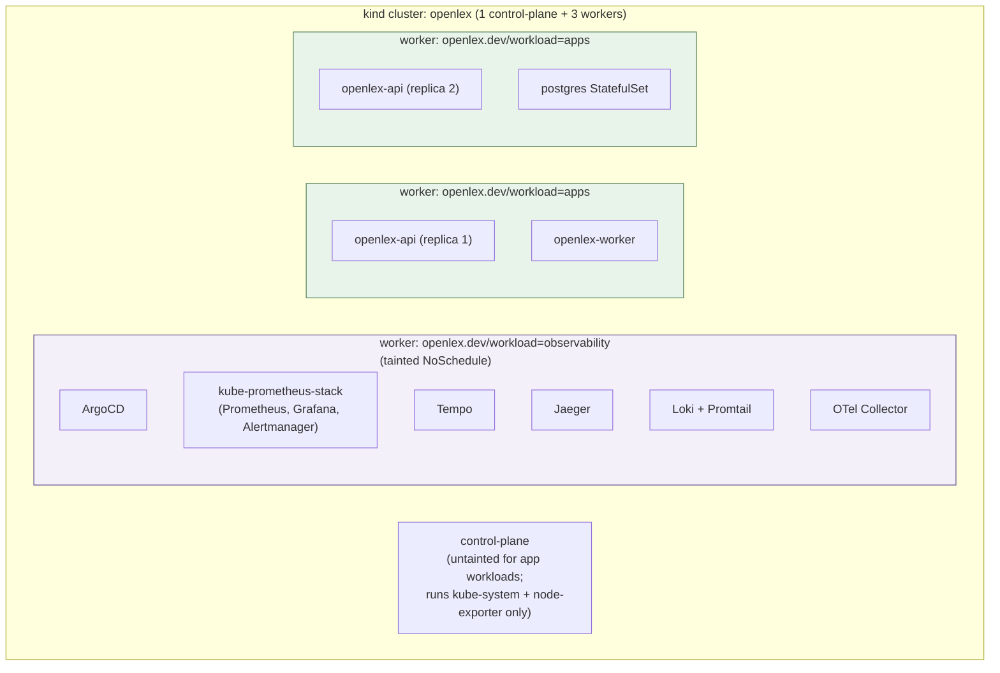

# Kubernetes topology: nodes, taints, scheduling, and what "HA" actually means here

How the kind cluster is actually built, why, and what it does and doesn't prove. Companion to
[`architecture-diagrams.md`](./architecture-diagrams.md) (service topology) and
[`dev-workflow-and-branching.md`](./dev-workflow-and-branching.md) (branch/CI-CD flow) — this
doc is specifically about node-level design: taints, scheduling, disruption budgets, and the
honest limits of what a kind cluster can demonstrate.

## Node topology

(Exact pod placement across the two `apps` nodes shifts over time — see "Steady-state spread
isn't self-healing" below — the diagram shows one representative layout, not a pinned one.)

**Why 4 nodes, not 1:** to mimic real separation-of-concerns instead of everything landing on
a single node, which would prove nothing about scheduling, taints, or disruption behavior. One
worker is dedicated to the observability stack; the other two carry application workloads,
which is what makes `openlex-api`'s 2-replica anti-affinity meaningful (see below) instead of
same-node anti-affinity that proves nothing.

**Config:** `infra/kubernetes/kind/kind-config.yaml`. kind can't add nodes to a running
cluster — changing this file requires `kind delete cluster --name openlex &&
scripts/kind/up.sh` (destructive: wipes all workloads, including Postgres data), a deliberate,
separate step, never automatic on commit.

## Taints, labels, and tolerations

The observability worker is both **labeled** (`openlex.dev/workload=observability`) and
**tainted** (`openlex.dev/workload=observability:NoSchedule`) at cluster-config time. Every
observability component (`kube-prometheus-stack`'s sub-charts, OTel Collector, Tempo, Jaeger,
Loki/Promtail) carries a matching `nodeSelector` + `tolerations` pair in its ArgoCD
`Application` manifest (`infra/argocd/apps/kind/app-*.yaml`) — the label pulls it onto that
node, the toleration is what actually lets it schedule there despite the taint (a label alone
doesn't bypass a taint; both are required).

**The one deliberate exception:** `prometheus-node-exporter` runs as a `DaemonSet` (needs to
run on *every* node, including the tainted one and the control-plane, to actually report their
metrics) — it uses the chart's own default blanket toleration
(`{effect: NoSchedule, operator: Exists}`, tolerates *any* `NoSchedule` taint) rather than the
observability-specific one. This was a real bug once: an earlier pass replaced the blanket
toleration with only the observability-specific entry, and Helm's array-*replace* (not merge)
semantics silently dropped control-plane scheduling — confirmed live at the time (`node-exporter`
missing from the control-plane entirely). Restoring the chart's default fixed it. Worth
knowing if this file is touched again: array fields in Helm values don't merge with chart
defaults, they replace them wholesale.

## Scheduling: `openlex-api`'s 2-replica anti-affinity

`infra/kubernetes/overlays/kind/patch-resources.yaml` runs `openlex-api` at 2 replicas with
`nodeSelector: openlex.dev/workload=apps` (keeps it off the observability node) and a
**preferred** (soft) `podAntiAffinity` on `kubernetes.io/hostname` (spread the two replicas
across the two apps nodes when possible).

**Why soft, not hard:** a `required` (hard) anti-affinity was tried and rejected — confirmed
live via a real `kubectl drain` test. With only 2 apps nodes, draining one leaves nowhere for
that node's replica to go under a *hard* rule — it gets stuck `Pending` for the whole drain,
which defeats the point of draining at all. A **soft** rule lets the evicted replica land
wherever there's room (including the other apps node, alongside the replica already there).

**Steady-state spread isn't self-healing:** the real tradeoff of the soft rule — after a
drain-and-reschedule, both replicas can end up co-located on the same apps node, confirmed
live (this actually happened during testing). Nothing re-spreads them automatically
afterward; a Kubernetes descheduler (or a 3rd apps node) would be needed for that, and neither
exists here — explicitly out of scope at kind's scale.

## PodDisruptionBudget: what it actually proves

`infra/kubernetes/overlays/kind/pdb-openlex-api.yaml` sets `minAvailable: 1` for
`openlex-api`. This is what actually backs the "HA" claim of running 2 replicas — without it,
a voluntary disruption (`kubectl drain`, `kubectl evict`) could legally take both replicas
down simultaneously, since Kubernetes has no other reason to leave one running.

**Proven live**, not just configured: a real `kubectl drain` against one apps node was run
during this project's history, and confirmed the PDB held — one replica stayed serving traffic
throughout, zero downtime, while the other was evicted and rescheduled. This is *disruption
survivability*, proven; it is not *steady-state spread*, which (see above) is best-effort only.

## What this does and does NOT prove about HA

Said plainly, in the kind cluster config's own words: **kind's "nodes" are containers on one
Docker daemon on one laptop, not separate hosts.** There is no real network partition,
availability zone, or hardware failure isolation between them. A `kubectl drain` exercises the
*Kubernetes-level* mechanics (taints, scheduling, PDBs, rolling eviction) genuinely and
correctly — but it does not simulate a real host dying, a real AZ outage, or real network
splits. This setup demonstrates the **design** (nodeSelector, taints, anti-affinity, PDBs) and
exercises the **real tooling** faithfully; it is not a substitute for testing against actual
infrastructure-failure scenarios, which only a real multi-AZ cloud environment (eks-demo, not
yet deployed — see below) could provide.

## Contrast: `eks-demo`'s topology today

`infra/terraform/variables.tf`'s `node_desired_size` defaults to **1** — the (never-deployed)
`eks-demo` environment currently has no multi-node topology, no taints, no meaningful PDB
story, and no real HA at all. This is a deliberate, cost-driven choice for a single-purpose
demo cluster (see [`aws-eks-cost-estimate.md`](./aws-eks-cost-estimate.md)), not an oversight
— but it means kind's node-level HA story doesn't currently have a cloud equivalent. Extending
`eks-demo` to multiple nodes/AZs with matching taints and PDBs, if ever wanted, is real future
work, not assumed or implied by anything in this document.

## Local setup requirements to actually run this

Beyond the root [`README.md`](../../README.md)'s docker-compose prerequisites, running the
**kind** cluster (staging environment, full observability stack, real ArgoCD GitOps — see
[`dev-workflow-and-branching.md`](./dev-workflow-and-branching.md)) needs more:

**Tools** (beyond docker-compose's Docker + `uv`):
- [`kind`](https://kind.sigs.k8s.io/) — the local Kubernetes distribution itself
- `kubectl` — cluster interaction
- [`kustomize`](https://kubectl.docs.kubernetes.io/installation/kustomize/) — the CLI
  (`kubectl kustomize` covers rendering, but `kustomize edit set image` used by
  `scripts/kind/use-local-images.sh` needs the standalone binary)
- `helm` — `scripts/kind/argocd-bootstrap.sh` installs ArgoCD itself via `helm upgrade --install`
  (the one imperative, chicken-and-egg step before ArgoCD can manage everything else)
- `argocd` CLI — optional, only needed for `scripts/kind/argocd-bootstrap.sh`-adjacent manual
  operations; the ArgoCD UI/`kubectl` cover everything else

**Docker Desktop resource allocation** (Settings → Resources): this cluster runs 4 kind nodes
(each a real container) plus a full observability stack (Prometheus, Grafana, Tempo, Jaeger,
Loki, OTel Collector, Alertmanager, ArgoCD) plus the application pods (`api` ×2, `worker`,
`postgres`, `web`) all at once. Recommended minimums:
- **CPU:** 6+ cores allocated to Docker Desktop
- **Memory:** 8GB+ allocated to Docker Desktop (the observability stack alone reserves real
  memory across its components even at kind-scale request/limit values)
- **Disk: this is the one that actually bit this project.** Docker Desktop's own VM has a
  *capped virtual disk*, separate from your host machine's free space, shared across every
  local Docker/kind cluster on the machine (including unrelated projects). This project hit
  genuine disk exhaustion twice during its history: once from a missing `.dockerignore`
  bloating build contexts with stale `.claude/worktrees/*` checkouts (fixed — see the repo's
  `.dockerignore`), and once from `kind load docker-image`'s repeated rebuild cycles silently
  accumulating superseded image digests in each node's containerd store (no automated
  cleanup exists for this yet — see `docs/postmortems/2026-07-14-disk-exhaustion-during-ingest.md`
  for the full incident). Practical guidance: allocate as large a virtual disk to Docker
  Desktop as you can afford, and periodically check `docker system df` / run
  `docker builder prune -f` if builds start failing with "no space left on device."

**Getting started:** `scripts/kind/up.sh` (create the cluster) →
`scripts/kind/argocd-bootstrap.sh kind` (install ArgoCD + the app-of-apps root) →
`scripts/kind/secrets-bootstrap.sh` (populate `openlex-secrets` from your local `.env`) →
`scripts/kind/load-images.sh` (build + load the three application images) — see
[`dev-workflow-and-branching.md`](./dev-workflow-and-branching.md) for the ongoing day-to-day
loop once the cluster exists.
