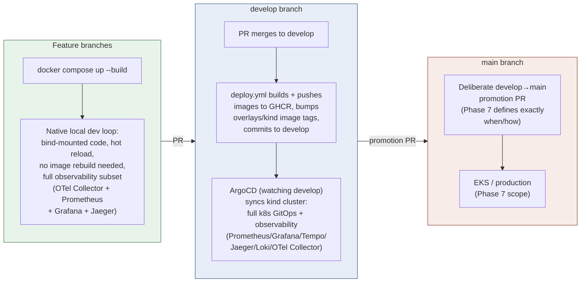
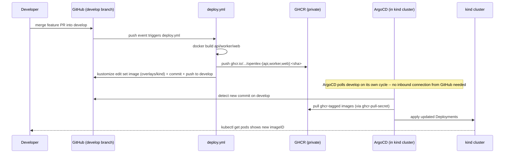

# Phase 6 — CI/CD Hardening — Design

**Status:** approved design, pending implementation plan (revised 2026-07-14 after feedback:
docker-compose becomes the native local dev loop with observability parity, ArgoCD/kind moves
to a `develop` branch as a staging environment, `main` is reserved for EKS/production)
**GA checklist:** `docs/superpowers/plans/2026-07-12-ga-readiness-checklist.md`'s Phase 6
(6.1–6.3 covered here; 6.4/6.5 explicitly deferred — see "Explicitly out of scope")
**Builds on:** the existing kind + ArgoCD GitOps setup (`infra/kubernetes/overlays/kind`,
`infra/argocd/apps/kind/`), `scripts/kind-load-images.sh`/`scripts/kind-secrets-bootstrap.sh`'s
established manual-bootstrap conventions, `evaluation.yml`'s existing docker-compose
stack-bringup pattern, and the existing (currently minimal) `docker-compose.yml`.

## Goal

Per `CLAUDE.md`'s scope philosophy, this project's actual purpose is demonstrating SRE/
Platform operational depth, and CI/CD maturity is one of the highest-value remaining gaps.
Three real gaps, addressed here:

1. **No real environment model.** Every deployment this whole project has done so far has been
   a manual `docker build` + `kind load docker-image` + `kubectl delete pod` sequence run by a
   human, against a single kind cluster that every branch effectively shares. There's no
   distinction between "I'm iterating on code," "this is what staging looks like," and "this is
   what would actually ship" — which is itself a real gap for a project meant to demonstrate
   platform engineering maturity, not just a working app.
2. **`docker-compose.yml` has gone stale.** It has `db`/`db-test`/`api`/`worker`/`web` and
   nothing else — no observability at all (no OTel Collector, Prometheus, Grafana, or a trace
   backend) — while the kind cluster accumulated a full observability stack over this project's
   history. A developer using `docker compose up` today gets a materially worse debugging
   experience than one using kind, for no good reason.
3. **No real CI/CD pipeline.** Real tests (`tests/integration/`) aren't gated in CI at all,
   `tests/end_to_end/` is an empty stub, and there is no automated build → publish → deliver
   path — every image was hand-built and hand-loaded.

## Environment and branch model

Three distinct environments, each with a clear purpose and a clear branch/trigger relationship:

| Environment | Branch | Trigger | Purpose | Stack |
|---|---|---|---|---|
| Local dev | any feature branch | manual (`docker compose up`) | Fast iteration — edit code, see it run, no rebuild/reload cycle | docker-compose: `db`, `api`, `worker`, `web` + lightweight observability subset (below) |
| Staging | `develop` | automatic (`deploy.yml` on push) | GitOps-realistic environment — proves the real build→registry→delivery pipeline works | kind + ArgoCD, full observability stack (unchanged from what's running today) |
| Production | `main` | manual, deliberate promotion (Phase 7) | Simulates a real production boundary — nothing lands here by accident | EKS (Phase 7 scope — not built yet) |

**Why `develop`/`main` over per-feature-branch ArgoCD sync:** an ephemeral-preview-per-branch
model (ArgoCD `ApplicationSet` watching a branch glob, dynamic namespaces) is a legitimate
pattern, but it's real added machinery — dynamic manifest generation, per-branch resource
cleanup, namespace collision handling — that this project's scope doesn't need to demonstrate
the same operational maturity story. `develop`/`main` is the standard, single most common
real-world environment-promotion model: easy to explain, easy to diagram, and every step maps
onto something a real platform team actually does.

**Consequence for this project's own workflow:** day-to-day PRs now target `develop`, not
`main` (a real change from every PR this session has opened so far). `main` only moves via a
deliberate `develop`→`main` promotion PR, which Phase 7 will define the trigger/criteria for
(not designed here — out of scope until EKS/production actually exists to promote *to*).

## 6.0 — Docker-compose parity: the native local dev loop

**Problem:** `docker-compose.yml` currently has `db`, `db-test` (integration-test-only,
profile-gated), `api`, `worker`, `web` — no observability. `apps/api`/`apps/worker` already
call `setup_telemetry()` unconditionally, but nothing in docker-compose provides an OTLP
endpoint for it to export to, so spans are generated and silently dropped (the exporter retries
against an unreachable host in the background, not visibly broken, just pointless).

**Design:** add a **deliberately smaller** observability subset than kind's — this is a fast
local loop, not a second full copy of the staging stack:

- **OTel Collector** (`otel/opentelemetry-collector` image, matching the one already used in
  kind) — receives traces from `api`/`worker`, exports to Jaeger below. `api`/`worker` gain an
  `OTEL_EXPORTER_OTLP_ENDPOINT=http://otel-collector:4318` environment entry.
- **Jaeger all-in-one** (`jaegertracing/all-in-one` image) — one container, built-in storage,
  UI on `16686:16686`. Deliberately **not** also running Tempo: kind's dual-backend setup exists
  to compare the two (already proven out, see this project's history); local dev doesn't need
  that comparison repeated, one trace backend is enough.
- **Prometheus** (`prom/prometheus` image) — a minimal static `prometheus.yml` scrape config
  targeting `api:8000/metrics` directly (docker-compose's built-in service-name DNS makes this
  trivial — no ServiceMonitor/service-discovery machinery needed, unlike kind).
- **Grafana** (`grafana/grafana` image) — provisioned with the **same dashboard JSON files**
  already committed under `infra/monitoring/grafana/dashboards/**` (bind-mounted read-only,
  same files kind's ConfigMap-sidecar setup uses) and datasources pointed at the compose
  Prometheus/Jaeger — no dashboard content is duplicated or redefined for compose.
- **Deliberately not included:** Loki/Promtail (log aggregation solves "which of N pods emitted
  this line, and where did it go" — with one container per service and `docker compose logs
  <service>` right there, that problem barely exists in compose) and Alertmanager (no on-call
  rotation exists for a laptop). Both are real, intentional scope-downs, not oversights.

All of this is additive to `docker-compose.yml` — `db`/`api`/`worker`/`web`'s existing
definitions (bind mounts, `env_file: .env`, healthchecks) are unchanged.

## 6.1 — Gate `tests/integration/` in CI

**Problem:** `api.yml` and `pipelines.yml` only run mock-based unit tests (`apps/api/tests`,
`packages/*/tests`) — nothing in CI ever exercises `legal_retrieval.hybrid_search` or the
ingestion write-path against a real Postgres+pgvector. `tests/integration/` (27+ tests,
including this session's new `test_hybrid_search_caps_one_chunk_per_document` regression test)
only runs when a developer remembers to run `scripts/test-db.sh up` locally.

**Design:** new workflow `.github/workflows/integration.yml`, triggered on PRs touching
`packages/legal_retrieval/**`, `packages/legal_parsing/**`, `packages/legal_models/**`,
`packages/shared/**`, `pipelines/**`, `migrations/**`, `tests/integration/**` — regardless of
target branch (feature→develop and develop→main PRs both get this gate; it's a correctness
check, not an environment-specific one). Uses a GitHub Actions `services:` Postgres container
(`pgvector/pgvector:pg16`, matching `scripts/test-db.sh`'s local image exactly), with a
`pg_isready`-based health check gate before the test step runs. Applies every file in
`migrations/postgres/*.sql` in filename order via `psql` before tests run (mirrors `scripts/
test-db.sh reset`'s behavior) — not a hardcoded migration count, so a future new migration file
is picked up automatically. Sets `TEST_DATABASE_URL` to point at the service container's
`localhost` port. Runs `uv run pytest tests/integration -v`.

No change to `tests/integration/conftest.py` or any test file — this is a CI-wiring change
only, reusing the exact fixtures/connection-string override mechanism that already exists for
local runs.

## 6.2 — Real end-to-end smoke test

**Problem:** `tests/end_to_end/README.md` says "Nothing here yet" and its own stated reason
("no running API to test against") has been stale since `apps/api/src/openlex_api/main.py` was
built — this is now just an empty promise, not a real gap description.

**Design:** replaces the stub with one real smoke test file (`tests/end_to_end/
test_smoke.py`) exercising the actual golden path against a live stack: register/seed a demo
user, `POST /auth/login`, `POST /query` with a question matched to a seeded statute, assert the
response has `abstained: false`, a non-empty answer, at least one citation, and the disclaimer
present. This deliberately does *not* re-test citation accuracy (that's `tests/evaluation`'s
job) — it only proves the full request path (auth → retrieval → generation → response shape)
is alive.

New workflow `.github/workflows/smoke.yml`, triggered on **every PR**, any target branch
(broad trigger — this is a cheap, fast "is anything fundamentally broken" gate, not a
path-filtered specialist check like `api.yml`/`pipelines.yml`). Reuses `evaluation.yml`'s
established stack-bringup pattern (`docker compose up -d --build db api worker`, wait for
`/healthz` to report `status: ok`, `scripts/ingest.sh statutes`, `scripts/seed-demo-users.sh`)
— extracting that bring-up sequence into a small reusable step isn't required for this phase
(duplicating ~15 lines across two workflows is acceptable; a shared composite action is a fair
future refactor if a third consumer appears, not before). One real Anthropic call (Haiku,
matching `evaluation.yml`'s cost-consciousness precedent), not the full golden-question suite.

## 6.3 — Real deploy pipeline: GHCR + GitOps to `develop`, local-dev path preserved

**Problem:** there has never been a build that isn't run by a human — every image this session
has ever deployed was hand-built and hand-loaded into kind.

**Design:**

### Registry and build

New workflow `.github/workflows/deploy.yml`, triggered on push to **`develop`** (not `main` —
see "Environment and branch model" above). Builds `openlex-api`, `openlex-worker`,
`openlex-web` (same `Dockerfile`s already in use, unchanged) and pushes each to GHCR as
**private** images: `ghcr.io/<owner>/openlex-{api,worker,web}:<git-sha>`. Auths via the
workflow's own `GITHUB_TOKEN` with `packages: write` permission — no new secret to provision.
Private, not public: more realistic for a production-like story, and it means the pull path
genuinely exercises registry-auth handling in Kubernetes rather than skipping it.

`deploy.yml` needs an explicit `permissions: {contents: write, packages: write}` block (the
default `GITHUB_TOKEN` scope is read-only on a repo with restrictive default settings, and this
job both pushes packages *and* commits back to `develop` — both must be granted explicitly, not
assumed from a passing build).

### GitOps delivery — no network path from GitHub to the local cluster needed

GitHub-hosted runners cannot reach a `kind` cluster running on a laptop — there is no direct
`kubectl apply`/`rollout restart` path from CI to the cluster, and this design does not attempt
one. Instead, `deploy.yml`'s final step runs `kustomize edit set image` inside
`infra/kubernetes/overlays/kind` to point the `images:` transformer at the three freshly-pushed
`ghcr.io/...:<git-sha>` tags, commits that change with a bot identity ("chore: deploy
`<sha>`"), and pushes to **`develop`**. ArgoCD — already running inside the kind cluster —
picks up that commit on its own polling cycle and pulls the new images itself. The pull happens
from *inside* the cluster; GitHub never needs to reach it. This is the standard GitOps pull
model, not a workaround.

### Retargeting ArgoCD to `develop`

Every existing Application manifest under `infra/argocd/apps/kind/` (`app-openlex.yaml`,
`app-loki.yaml`, `app-jaeger.yaml`, `app-tempo.yaml`, `app-otel-collector.yaml`,
`app-kube-prometheus-stack.yaml`, `app-postgres-exporter.yaml`, `app-promtail.yaml`,
`app-observability-dashboards.yaml`) currently sets `targetRevision: main` for this repo's own
source (their `repoURL: https://github.com/.../OpenLex.git` entries — third-party Helm-chart
`repoURL`s with their own semver `targetRevision`s, like `kube-prometheus-stack`'s `"87.15.*"`,
are untouched). Every one of these needs `targetRevision: develop`. This is mechanical but
broad — 9 files, one line each — and is its own explicit task in the implementation plan, not
a detail to discover mid-implementation.

A `develop` branch needs to exist (branched from current `main`) before this retarget lands, or
ArgoCD will fail to find the ref.

### Registry auth inside the cluster

New script `scripts/kind-ghcr-pull-secret-bootstrap.sh`, following `scripts/
kind-secrets-bootstrap.sh`'s exact established convention (manual, idempotent, not
ArgoCD-managed — the same accepted local-only exception already used for `openlex-secrets`,
since kind has no IRSA/External Secrets Operator to automate this). Reads a GHCR username +
PAT from `.env` (new `GHCR_USERNAME`/`GHCR_PAT` vars, documented in `.env.example` as
"personal access token with `read:packages` scope, used only to bootstrap the local pull
secret — never wired into `openlex_shared.config.Settings` or any runtime code path," mirroring
`COURTLISTENER_API_TOKEN`'s existing "seed-curation-only, not a runtime setting" framing), and
runs `kubectl create secret docker-registry ghcr-pull-secret --docker-server=ghcr.io
--docker-username=... --docker-password=... --dry-run=client -o yaml | kubectl apply -f -` in
the `openlex` namespace. `infra/kubernetes/base/{api,worker,web}/deployment.yaml` each gain an
`imagePullSecrets: [{name: ghcr-pull-secret}]` entry.

### Local-dev fast path — unchanged, and kept fast

`scripts/kind-load-images.sh` is **not modified** — building and `kind load docker-image`-ing
straight into the cluster's containerd store, with zero registry round-trip, stays exactly as
fast as it is today. (Note: with docker-compose now the recommended *native* local loop per 6.0,
this kind fast-path is mainly for verifying something specifically against the GitOps-managed
staging environment without waiting on a full `deploy.yml` run — still a real, useful mode, just
no longer the *primary* one.)

The gap this creates: after `kind-load-images.sh` loads a `:kind-local`-tagged image, the
overlay's committed `images:` block still points at whatever `ghcr.io/...:<sha>` tag the last
real deploy set — so a plain `kubectl apply -k` or ArgoCD sync would keep pulling the old GHCR
image, not the freshly-loaded local one.

New companion script `scripts/use-local-images.sh` closes that gap: runs `kustomize edit set
image openlex-api=openlex-api:kind-local openlex-worker=openlex-worker:kind-local
openlex-web=openlex-web:kind-local` inside `overlays/kind` — an **uncommitted, working-tree-only**
edit. The developer then applies it locally (`kubectl apply -k infra/kubernetes/overlays/kind`,
or lets ArgoCD's local diff show `OutOfSync` and syncs manually) and iterates freely. Because
the edit is never committed, it can't drift from what's actually deployed elsewhere: the next
`git pull` (or the next real `deploy.yml` run) cleanly restores the GHCR-tag state with a plain
`git checkout -- infra/kubernetes/overlays/kind/kustomization.yaml` (or just a fresh clone/pull
overwriting the local edit). Two modes, one overlay, no proliferation, no permanent fork.

### What ArgoCD's own drift-detection sees

Between a real `deploy.yml` run and the next one, `overlays/kind/kustomization.yaml`'s
committed state is the GHCR tags — ArgoCD reports `Synced` against that. While a developer is
using `use-local-images.sh` locally, ArgoCD will report `OutOfSync` (the live cluster state now
differs from the committed manifest) — this is expected and correct, exactly mirroring how
`selfHeal: true` already behaves whenever anyone hand-edits a live resource; it is not a new
failure mode, just the existing one now also covering this specific field.

## Testing

- 6.0: verified by bringing up the full docker-compose stack locally, confirming traces from a
  real `/query` call land in the compose Jaeger UI, confirming Prometheus shows `up{job="api"}
  == 1` and real `openlex_http_requests_total` series, and confirming Grafana renders the same
  dashboards kind uses with real (not empty) data.
- 6.1: the new workflow itself is the test — verified by opening a PR that touches
  `tests/integration/**` and confirming the Actions log shows the suite actually running (not
  skipped), with a deliberately-broken assertion first to confirm a real failure shows red
  (then reverted), matching this project's "verify every claim live" discipline.
- 6.2: same verification approach — confirm the smoke test runs on an unrelated PR (proving the
  broad trigger works) and fails loudly if the golden path breaks (verified with a deliberate
  temporary breakage, then reverted).
- 6.3: verified by watching one real `deploy.yml` run end-to-end after merging this phase's
  implementation PR into `develop` — confirm images land in GHCR, confirm the bot commit lands
  on `develop`, confirm ArgoCD picks it up and the running pods' `imageID`s match the
  newly-pushed digests (same `kubectl get pods -o custom-columns=...:.status.containerStatuses
  [0].imageID` verification pattern already used throughout this project's prior redeploys).

## Repo/workflow changes this phase requires

- Create `develop` branch from current `main` HEAD, before the ArgoCD retarget lands.
- Retarget all 9 `infra/argocd/apps/kind/*.yaml` manifests' own-repo `targetRevision` from
  `main` to `develop`.
- This project's own day-to-day PR workflow changes: open PRs against `develop`, not `main`,
  going forward. (GitHub repo default-branch/base-branch settings are a manual, one-time
  console change — noted here so it isn't lost, executed as part of the implementation plan.)

## Open questions / risks

- **Bot commit noise on `develop`:** every merge now produces two commits (the feature merge +
  `deploy.yml`'s tag-bump commit). Acceptable for a single-environment demo project.
- **GHCR PAT rotation:** `GHCR_PAT` in `.env` is a personal credential with an expiry;
  `kind-ghcr-pull-secret-bootstrap.sh`'s idempotent re-run is the rotation mechanism (re-run
  after updating `.env`), same pattern as every other credential in this file.
- **Concurrent local-image and GHCR-image use:** if a developer runs `use-local-images.sh`,
  forgets about it, and later commits `overlays/kind/kustomization.yaml` by accident, they'd
  commit their local override. Mitigated by the file being small and the diff being obvious in
  `git status`/PR review, not by tooling — acceptable for a single-developer project.
- **`develop`/`main` divergence before Phase 7 exists:** until Phase 7 defines the actual
  promotion mechanism, `main` simply doesn't move — this is intentional (nothing to promote to
  yet), not a gap this phase needs to solve.
