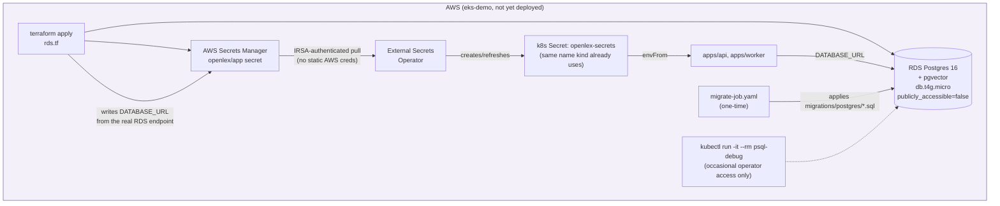
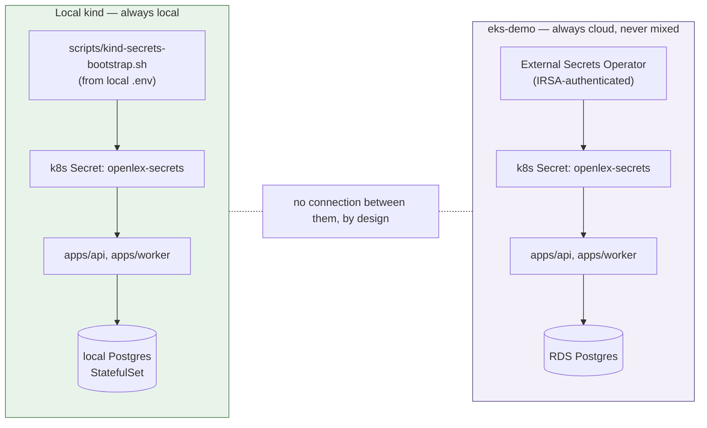
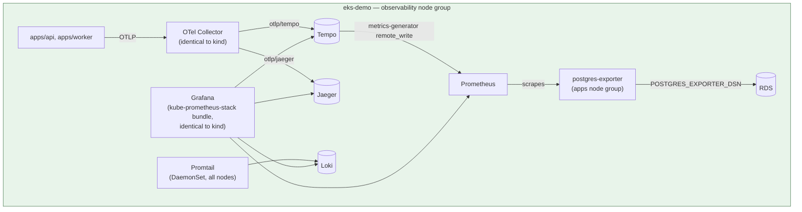
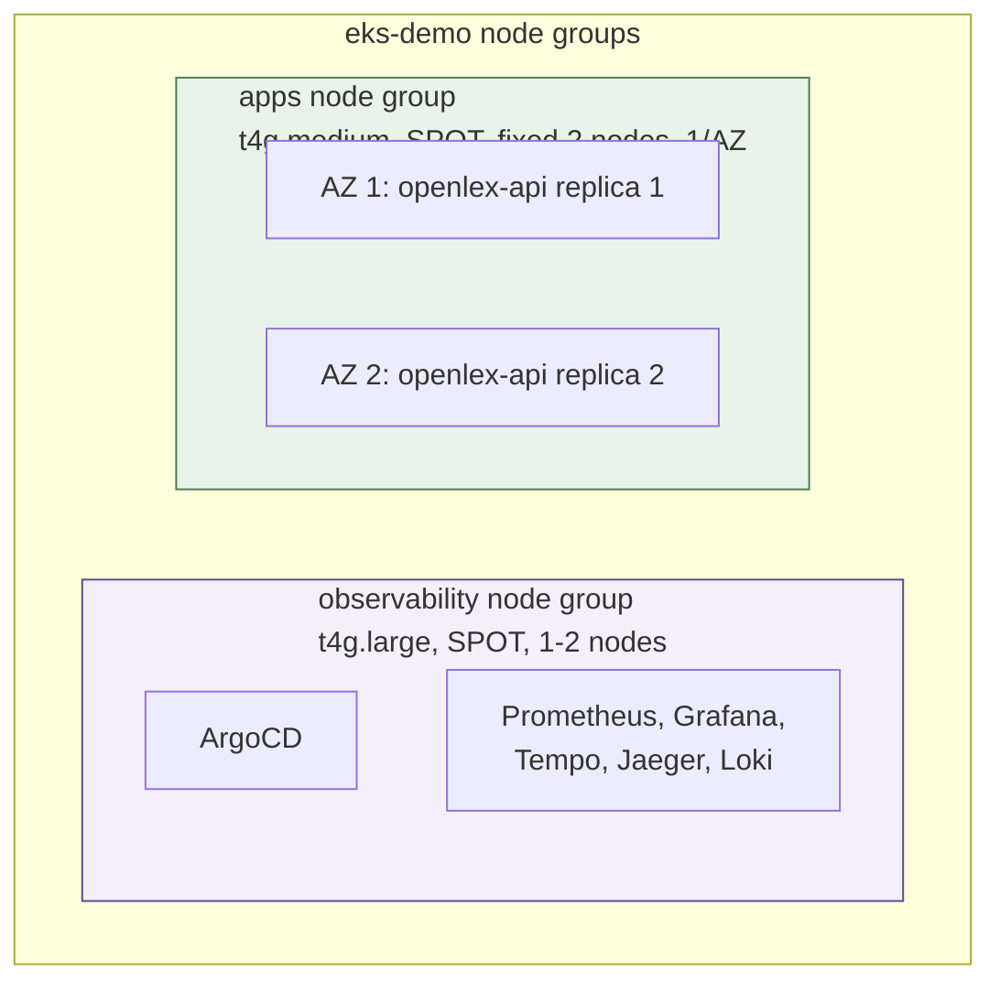
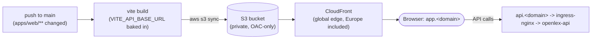

# Phase 7 — AWS RDS + Secrets Manager + External Secrets — Design

**Status:** approved design, pending implementation plan
**GA checklist:** `docs/superpowers/plans/2026-07-12-ga-readiness-checklist.md`'s Phase 7
(7.1–7.5)
**Builds on:** the existing (never live-verified) `eks-demo` scaffolding —
`infra/terraform/{eks,vpc,iam_irsa_external_secrets,security_groups}.tf`,
`infra/argocd/apps/eks-demo/{secretstore-aws,app-external-secrets,argocd-admin-externalsecret}.yaml`,
`infra/kubernetes/overlays/eks-demo/externalsecret-openlex.yaml` — and the local kind
bootstrap-script convention (`scripts/kind-secrets-bootstrap.sh`).

## Goal

Phase 6 deliberately kept CI/CD AWS-free (GHCR, not ECR) to close out CI/CD essentials without
a real-money dependency. Phase 7 is the actual cloud-production path this project's
`eks-demo` scaffolding was always aimed at, but never finished: a managed database (the
in-cluster Postgres `StatefulSet` has no backup/DR story at all today), and completing/
verifying the Secrets Manager + External Secrets Operator integration that already exists in
manifest form but has never actually run.

**Explicitly in scope:** RDS Postgres for the eks-demo/production path (7.1), verifying and
completing the existing Secrets Manager + External Secrets Operator manifests (7.2),
documenting the deliberate environment isolation between local kind and cloud (7.3), Terraform
remote state (7.4, closes the old 6.4), a Postgres backup/DR strategy (7.5, closes the old
6.5), mirroring kind's self-hosted observability stack (kube-prometheus-stack + Tempo + Jaeger
+ Loki + Promtail) onto real multi-AZ compute, with AWS-native managed observability
(X-Ray/CloudWatch) explicitly deferred as a future enhancement (7.6, revised), a two-node-group
topology mirroring kind's observability/apps separation with real multi-AZ HA (7.7), static
`apps/web` hosting via S3 + CloudFront (7.8), and ingress + auth for Grafana/ArgoCD with
port-forward-only access for Prometheus/Jaeger (7.9, revised) — none of 7.6-7.9 were in the
original roadmap sketch; all added during this design pass, then 7.6/7.9 revised again after
the implementation plan was already written (see those sections' own "Revised" notes).

**Explicitly out of scope:** actually running `terraform apply` against a real AWS account, or
any other live AWS deployment/verification — confirmed with the user: this phase produces
real, complete, `terraform validate`-clean infrastructure-as-code and manifests, ready to
deploy whenever a live EKS demo is actually wanted, not a live deployment itself. No changes
to `docker-compose.yml` or the `develop`/kind GitOps pipeline from Phase 6 — those stay
exactly as they are, and (per a design revision — see 7.3) local kind never gains any path to
real AWS resources at all, not even an optional one.

## 7.1 — RDS Postgres

**Problem:** `infra/terraform/` has no RDS resource of any kind today — the in-cluster
Postgres `StatefulSet` (`infra/kubernetes/base/postgres/`) is the only database this project
has ever had, on either kind or the (never-deployed) eks-demo path. It has no automated
backups, no managed failover, no serious DR story.

**Design:**

- New `infra/terraform/rds.tf`: a single `aws_db_instance`, engine `postgres`, version `16`
  (matching local dev's `pgvector/pgvector:pg16` exactly), instance class `db.t4g.micro`
  (Graviton, matching this repo's existing cost-conscious node-type precedent in
  `variables.tf`'s `node_instance_type`), `storage_type = "gp3"`, `allocated_storage = 20`
  (GB — pgvector's HNSW index plus this project's actual corpus size, low tens of MB today,
  leaves enormous headroom at 20GB; a defensible starting default, not a measured optimum).
- **Subnet placement — corrects an assumption from initial discussion:** `infra/terraform/
  vpc.tf` is deliberately public-subnets-only (`private_subnets = []`, no NAT Gateway, to
  avoid its ~$32+/mo cost — see the file's own comment and `docs/infrastructure/
  aws-eks-cost-estimate.md`). RDS does **not** get its own new private subnet group — it
  joins the existing public subnets via a `aws_db_subnet_group`, exactly like the EKS nodes
  do, with `publicly_accessible = false` and a dedicated security group as the actual
  isolation boundary (allowing inbound `5432` only from the EKS cluster's own node security
  group) — not subnet-level isolation. This matches the VPC's existing security model:
  public subnets, tight security groups, no NAT Gateway, rather than introducing a
  fundamentally different (and cost-additive) networking pattern for one resource.
- **Secrets Manager wiring — closes an existing manual-step gap:** `infra/terraform/README.md`
  step 5 currently says to create the `openlex/app` Secrets Manager secret by hand. `rds.tf`
  instead writes `DATABASE_URL` (built from the real `aws_db_instance` endpoint + generated
  credentials) directly into that secret via `aws_secretsmanager_secret` +
  `aws_secretsmanager_secret_version` (using `random_password` for the DB password, never
  hardcoded) — the *other* keys `openlex/app` needs (`ANTHROPIC_API_KEY`,
  `NY_OPEN_LEG_API_KEY`, `JWT_SECRET_KEY`, `DEMO_*`) stay manually created, since those are
  genuinely external credentials Terraform has no business generating. This is a real,
  bounded improvement over today's fully-manual step, not a full rewrite of it. `rds.tf` also
  writes a second derived key, `POSTGRES_EXPORTER_DSN` (same credentials, libpq-format,
  `sslmode=require`) — 7.6 (revised)'s `postgres-exporter` needs this the same way
  `scripts/kind-secrets-bootstrap.sh` already derives it locally for kind.
- **Migrations:** RDS has no `docker-entrypoint-initdb.d` equivalent (unlike the local
  `postgres` `StatefulSet`, which mounts `migrations/postgres/` directly). New one-time k8s
  `Job` manifest (`infra/kubernetes/overlays/eks-demo/migrate-job.yaml`) running the same
  `migrations/postgres/*.sql` files against the RDS endpoint via `psql` — mirrors
  `integration.yml`'s CI migration-apply loop (Phase 6) rather than inventing a new mechanism.

**Occasional operator access (not routine dev workflow):** RDS is never publicly reachable —
no bastion host, no SSM proxy, no VPN. For the rare case of needing to run `psql` against the
real instance directly (debugging, a one-off manual query), the EKS cluster itself is already
inside the VPC with a security-group path to RDS, so a throwaway debug pod is the simplest
correct answer: `kubectl run -it --rm psql-debug --image=postgres:16 -- psql $DATABASE_URL`.
Zero new AWS resources, reuses infrastructure that already exists, standard k8s operational
pattern — deliberately chosen over a dedicated bastion/SSM Session Manager setup, which would
be more infrastructure for the same result.

## 7.2 — Secrets Manager + External Secrets Operator: verify and complete

**Problem:** `ClusterSecretStore` (`secretstore-aws.yaml`), `ExternalSecret`
(`externalsecret-openlex.yaml`, `argocd-admin-externalsecret.yaml`), and the IRSA role
(`iam_irsa_external_secrets.tf`) already exist and, on inspection, are internally
consistent (the IRSA trust policy's `StringEquals` condition on
`system:serviceaccount:external-secrets:external-secrets` matches
`app-external-secrets.yaml`'s pinned `serviceAccount.name`; the `secrets_manager_path_prefix`
scoping matches the `openlex/*` secret paths actually referenced) — but none of this has ever
run against a real cluster, per this project's own "check before assuming" convention
(`CLAUDE.md`).

**Design:** since this phase doesn't deploy live (see "Explicitly out of scope"),
verification here means:

- A careful manual cross-check of every file in this chain against External Secrets
  Operator's actual documented CRD schema (`ClusterSecretStore`/`ExternalSecret` `apiVersion`/
  `spec` shape, specifically for `v1beta1` and the `aws`/`SecretsManager` provider block) —
  catching anything that would only surface as a runtime CRD-validation error.
  `externalsecret-openlex.yaml`'s `dataFrom.extract` shape (pull every key from one JSON
  secret) needs updating to also cover 7.1's new `DATABASE_URL` key once `rds.tf` writes it
  (should be automatic, since `dataFrom.extract` pulls the whole secret rather than
  naming keys individually — verify this assumption explicitly, don't just assert it).
- Confirming `README.md`'s step 4 (`terraform output external_secrets_role_arn`
  hand-copied into `app-external-secrets.yaml`'s ServiceAccount annotation) is accurately
  documented and the placeholder (`<EXTERNAL_SECRETS_ROLE_ARN>`) is unambiguous.
- No functional/behavioral changes expected here — this is a review-and-document pass, not
  new infrastructure, unless the review finds a real bug (in which case, fix it, and note it
  explicitly as "found during verification," not silently).

## 7.3 — Environment isolation: local kind never talks to real AWS

**Revised during design review.** The original sketch of this item proposed an opt-in hybrid
mode letting local kind pull secrets/connect to RDS from real AWS. Deliberately dropped, not
built: letting a developer's laptop reach into a cloud database is the specific anti-pattern
real platform teams try to eliminate, not something worth building convenience tooling for —
and once local and cloud are properly separated, there's no real problem left for a hybrid
mode to solve.

**Design — this item is now a documented boundary, not new code:**

- **Local kind:** always local Postgres + `.env`-derived `openlex-secrets` (exactly what
  exists today, via `scripts/kind-secrets-bootstrap.sh`). No changes. No path to real AWS
  resources, ever — not even an optional one.
- **Cloud (eks-demo):** always RDS + Secrets Manager + External Secrets Operator (7.1/7.2). No
  `.env` fallback for cloud.
- No developer ever needs credentials for *both* at once: local dev only ever needs `.env`;
  operating the cloud environment (for a project this size, that's the same person who
  provisions it) already has AWS access by definition.
- This also fully resolves the "how does local dev reach RDS without exposing it to the
  internet" question from the original brainstorm — it doesn't need to, because it never
  reaches it at all. Two complete, independently-correct patterns (env-file-backed local,
  vault-backed cloud) is a stronger demonstration of real practice than one blurred hybrid.

## 7.4 — Terraform remote state

**Problem:** `infra/terraform/backend.tf` has a commented-out S3 backend block, documented as
"upgrade once more than one person/machine touches this" — true today for a solo project, but
this phase closes the gap so it's ready.

**Design:** uncomment and parameterize the existing block (bucket/key/region/table already
sketched, just need real values via `terraform.tfvars` or a small separate bootstrap). Since
an S3 bucket + DynamoDB table can't be created by the same Terraform config that needs them to
exist first (the classic remote-state chicken-and-egg), document (not automate) a one-time
`aws s3api create-bucket` + `aws dynamodb create-table` bootstrap sequence in
`infra/terraform/README.md`, then `terraform init -migrate-state` to move existing local state
across. No new `.tf` file needed beyond uncommenting `backend.tf` — the bootstrap commands are
documentation, matching this project's existing precedent of keeping one-time infra bootstrap
as documented manual steps (e.g. the Route53 nameserver step) rather than self-referential
Terraform.

## 7.5 — Backup/DR

**Design:** resolved almost entirely by 7.1's `aws_db_instance` configuration —
`backup_retention_period = 7` (days), a `backup_window` set to a low-traffic UTC hour, and
`aws_db_instance.final_snapshot_identifier` set (so a future `terraform destroy` doesn't
silently discard the final state). Documented in `infra/terraform/README.md` as the actual DR
strategy: RDS's own automated daily snapshots, not a custom `pg_dump`-to-S3 pipeline — simpler
and free (included in RDS pricing up to the allocated storage size).

## 7.6 — Cloud observability: mirror kind's self-hosted stack (revised)

**Revised after the first implementation-planning pass.** The original design here proposed
AWS-native managed backends (X-Ray, CloudWatch Metrics/Logs, a standalone Grafana). Explicitly
reversed per direct feedback: this project's whole observability investment to date — every
dashboard, every alert rule, every design decision documented in
`docs/superpowers/specs/2026-07-12-production-observability-design.md` and
`docs/infrastructure/kubernetes-topology.md` — is kube-prometheus-stack + Tempo + Jaeger +
Loki + Promtail, matching what real-world teams (the explicit reference point: "what a startup
is using") actually run. `eks-demo` should demonstrate *that* stack surviving contact with a
real multi-node, multi-AZ cluster with real EBS-backed storage — not a parallel, cheaper stand-
in. AWS-native managed observability (X-Ray, CloudWatch, AWS Managed Prometheus/Grafana) moves
to "Future enhancement" below: a real, documented next stage, not this phase's design.

**Problem:** `eks-demo` has zero observability today — no OTel Collector, no Prometheus, no
Grafana, nothing (`infra/argocd/apps/eks-demo/` has no observability apps at all, confirmed by
listing the directory). 7.7's two-node-group topology (below) is what makes copying kind's full
stack possible here: a dedicated `observability` node group (`t4g.large`, larger than kind's
minimal worker specifically to give kube-prometheus-stack + Tempo + Jaeger + Loki + Promtail +
ArgoCD real headroom) plus the `aws-ebs-csi-driver` addon for real `gp3`-backed persistence,
where kind only had `rancher.io/local-path` on shared container disk.

**Design:** literally mirror kind's ArgoCD Application set — same charts, same shared
`infra/monitoring/{kube-prometheus-stack,tempo,jaeger,loki,promtail,postgres-exporter}/
values-base.yaml` files (already written to be consumed by "the kind Application and any
future eks-demo Application" per their own header comments — this was anticipated, not a
retrofit), same `openlex.dev/workload=observability` taint/label/toleration strings, same
Grafana dashboard ConfigMaps (`infra/monitoring/grafana/dashboards/`, already
environment-agnostic PromQL/LogQL/TraceQL — no CloudWatch-flavored parallel dashboards needed,
which also resolves the open question the original 7.6 draft flagged and never answered):

- **OTel Collector** — identical to kind's (`otlp/tempo` + `otlp/jaeger` dual export, core
  `otel/opentelemetry-collector` image). No AWS exporters, no IRSA needed at all — every hop
  stays inside the cluster.
- **Tempo + Jaeger** — identical to kind's (Tempo's `metricsGenerator` remote-writing to this
  environment's own `kube-prometheus-stack-prometheus` Service; Jaeger's in-memory storage,
  same "comparison backend, not primary" framing).
- **Loki + Promtail** — identical to kind's (`SingleBinary` mode, `replication_factor: 1`,
  Promtail's DaemonSet with the same three-entry toleration list so it schedules on both node
  groups, not just `observability`).
- **kube-prometheus-stack** (Prometheus + Alertmanager + Grafana + kube-state-metrics +
  node-exporter) — identical to kind's, including the shared file's `additionalPrometheusRulesMap`
  (the five symptom-based alerts) and Grafana's dashboard sidecar config. No new persistent
  storage added beyond what kind already has (kind's Prometheus is deliberately ephemeral,
  6h retention — mirrored exactly, not "upgraded" as part of this phase).
- **postgres-exporter** — same chart, retargeted at RDS instead of the in-cluster
  `StatefulSet`: 7.1's `rds.tf` writes a second derived key, `POSTGRES_EXPORTER_DSN`, into the
  same `openlex/app` Secrets Manager secret (mirroring `scripts/kind-secrets-bootstrap.sh`'s
  existing `+asyncpg`-stripping derivation for the same purpose, adjusted to `sslmode=require`
  since RDS — unlike kind's local Postgres — supports real TLS).
- **Storage:** Tempo's/Loki's PVCs need no `storageClassName` override — 7.7's `gp3`
  `StorageClass` is marked cluster-default, so they bind automatically, exactly as kind's PVCs
  bind automatically against kind's default `standard` StorageClass. This is an intentional,
  documented reliance on the default-class mechanism, not an oversight.

**Exposure — resolved together with 7.9, not independently:** Grafana gets real
internet-facing exposure (Ingress + `oauth2-proxy`, alongside ArgoCD's own separate native
login) — see 7.9. Prometheus and Jaeger have no built-in authentication and get **no Ingress
at all**; a new port-forward script gives an operator local-browser access instead, the same
pattern `scripts/observability-port-forward.sh` already established for kind (see 7.9).

**Future enhancement, explicitly not this phase:** AWS-native managed observability (X-Ray for
traces, CloudWatch Metrics via the collector's `awsemf` exporter, CloudWatch Logs via Fluent
Bit, AWS Managed Prometheus/Grafana) remains a legitimate later swap-in if this project ever
needs to demonstrate that pattern too, or if self-hosting's operational cost (SPOT
interruptions taking the whole stack down together, EBS cost, ArgoCD-managed Helm upgrades)
stops being worth it relative to a real workload. Same Grafana dashboards, different datasource
wiring underneath — not built now.

## 7.7 — Node topology: mirroring kind's separation, cloud-adjusted

**Problem:** `eks.tf` currently provisions **one** managed node group (`t4g.medium`, SPOT,
1-2 instances) — no separation between observability/ArgoCD and application workloads at all,
unlike kind's deliberate 3-worker split (`docs/infrastructure/kubernetes-topology.md`).

**Design:** two managed node groups, replacing the single `default` one, reusing kind's exact
taint/label scheme so `infra/argocd/apps/kind/app-*.yaml`'s existing `nodeSelector`/
`tolerations` blocks carry over to their `eks-demo` equivalents unchanged:

- **`observability` node group:** `t4g.large` (2 vCPU/8GB — larger than the apps group,
  deliberately: kube-prometheus-stack + Grafana + Tempo + Jaeger + Loki + ArgoCD all together
  need real headroom kind's minimal request/limit values only just fit into). SPOT capacity
  (matches this repo's existing cost-conscious default; interruption risk is an accepted
  tradeoff for a demo cluster, not fixed to on-demand). `min_size=1, max_size=2,
  desired_size=1` — letting the ASG scale to a 2nd node automatically only if pod resource
  requests genuinely can't fit on one, rather than hand-deciding node count upfront. Tainted
  `openlex.dev/workload=observability:NoSchedule`, labeled to match.
- **`apps` node group:** `t4g.medium` (matches today's instance type), SPOT,
  `min_size=2, max_size=2, desired_size=2` — fixed at 2, one per AZ. Unlike kind (containers on
  one Docker daemon, no real host/zone isolation), this VPC already provisions 2 real AZs
  (`vpc.tf`), so this is genuine multi-AZ separation, not kind's honestly-caveated
  best-effort version.
- **`openlex-api` anti-affinity becomes `requiredDuringSchedulingIgnoredDuringExecution`**
  (hard), not kind's `preferred` (soft) — safe here specifically because EKS managed node
  groups replace a drained/failed node automatically (unlike kind's fixed 2-node ceiling,
  where a hard rule risked a permanently `Pending` replica). `topologyKey:
  topology.kubernetes.io/zone` (AZ-level), not `kubernetes.io/hostname` — the semantically
  correct choice now that real zones exist to spread across, not just an incidental side
  effect of 1-node-per-zone.
- **New:** the `aws-ebs-csi-driver` EKS addon (`aws_eks_addon` resource) with its own IRSA
  role (`iam_irsa_ebs_csi.tf`, same pattern as `external-secrets`/`external-dns`) — required
  for Prometheus/Loki/Tempo's persistent volumes on real `gp3` EBS storage; not present in
  `eks.tf` today.
- New `infra/kubernetes/overlays/eks-demo/patch-resources.yaml` (doesn't exist yet — only the
  kind overlay has one today), mirroring kind's `nodeSelector`/affinity pattern with the hard/
  zone-level adjustment above.

## 7.8 — Static content (`apps/web`) via S3 + CloudFront

**Problem:** `apps/web` has never had a production build — it only ever runs as a Vite **dev
server** (`npm run dev`) in a container, even in the `eks-demo` overlay (its own Dockerfile
comment already documents this: "not a production nginx build"). Serving purely static assets
from a running Node.js process is neither the cloud-native pattern nor cheap at scale.

**Design:**

- `apps/web` gains a real production build path (`vite build` → static `dist/`) — this is new,
  not something the kind/compose path needs to change (those stay dev-server-based, unaffected).
- New Terraform: a private `aws_s3_bucket` (not public — CloudFront reaches it via Origin
  Access Control, not a public bucket policy) plus an `aws_cloudfront_distribution` in front of
  it. CloudFront's edge network is global by default, Europe included automatically — no
  special per-region configuration needed unless deliberately *restricting* to fewer regions,
  which isn't the goal here. ACM certificate for the CloudFront custom domain must be
  provisioned in `us-east-1` specifically — a real, easy-to-miss AWS requirement regardless of
  the rest of the infrastructure's region.
- **Domain split, replacing today's routing:** `app.<domain>` moves from
  ingress-nginx→web-pod to CloudFront/S3 (the static build); API traffic gets its own
  `api.<domain>` → ingress-nginx → `openlex-api` Service. `external-dns` already automates
  Route53 records from ingress annotations for the API side; `app.<domain>`'s record becomes a
  Route53 alias straight to the CloudFront distribution instead.
- **Real build-time-vs-runtime distinction to flag:** kind/compose inject `VITE_API_BASE_URL`
  at container *start* (`infra/kubernetes/base/web/deployment.yaml`'s `env:` block) because
  Vite's dev server reads it live. A static `vite build` bakes `VITE_API_BASE_URL` in at
  *build* time instead — the new CI workflow must set it to the real `api.<domain>` before
  running `vite build`, not after.
- New `.github/workflows/deploy-static.yml`: `on: push: branches: [main], paths:
  ["apps/web/**"]` — `npm run build` (with `VITE_API_BASE_URL=https://api.<domain>` baked in),
  `aws s3 sync dist/ s3://<bucket> --delete`, `aws cloudfront create-invalidation
  --distribution-id <id> --paths "/*"`. AWS access via GitHub's OIDC federation + a dedicated
  IAM role (new `iam_oidc_github_actions.tf`) — no static AWS access keys in GitHub secrets,
  matching this project's established "no static cloud credentials" precedent (IRSA
  everywhere else).

## 7.9 — Ingress + auth for Grafana/ArgoCD; port-forward for Prometheus/Jaeger (revised)

**Revised alongside 7.6.** The original design put `oauth2-proxy` in front of Grafana,
Prometheus, *and* Jaeger. Explicitly narrowed per direct feedback: only Grafana and ArgoCD get
real internet-facing exposure; Prometheus and Jaeger — which have no built-in authentication —
stay internal-only, reachable the same way they already are on kind, via `kubectl
port-forward`, not via a public Ingress at all. Fewer public endpoints is a real security
improvement (Prometheus/Jaeger's data isn't meant to be internet-facing at all, gated or not),
not just a scope cut.

**Problem:** once `eks-demo` is actually internet-facing, Grafana needs real exposure for the
same reason ArgoCD already has it (`argocd-admin-externalsecret.yaml`) — but Prometheus and
Jaeger have **no built-in authentication at all**, so putting them on the public internet at
all (even gated) is a larger exposure than this project needs; kind never exposes them
publicly either (kind has no ingress — `scripts/observability-port-forward.sh` is the only
access path).

**Design:**

- `ingress-nginx` (already the chosen, working ingress controller — not introducing Gateway
  API alongside it) + `oauth2-proxy` in front of **Grafana only**: new ArgoCD Application
  `app-oauth2-proxy.yaml` (Helm chart `oauth2-proxy/oauth2-proxy`), one new Ingress resource
  for the `kube-prometheus-stack-grafana` Service, annotated with
  `nginx.ingress.kubernetes.io/auth-url`/`auth-signin` pointing at `oauth2-proxy`'s endpoints —
  the standard, well-established ingress-nginx + oauth2-proxy integration pattern.
- **Prometheus and Jaeger get no Ingress at all.** A new
  `scripts/eks-demo-observability-port-forward.sh` — deliberately a new file, not an extension
  of kind's existing `scripts/observability-port-forward.sh` (7.3's isolation discipline: never
  touch kind-only files as part of cloud-path work) — `kubectl port-forward`s Grafana,
  Prometheus, Alertmanager, Jaeger, and ArgoCD against the `eks-demo` cluster context, mirroring
  kind's script service-for-service.
- **Scope decision, stated explicitly rather than silently overclaiming:** `ArgoCD` keeps its
  own existing native login (`argocd-admin-externalsecret.yaml`, already real and secure) —
  it is **not** additionally gated by `oauth2-proxy`. Putting ArgoCD behind `oauth2-proxy` too
  would mean either double-authenticating (proxy gate, then ArgoCD's own login) or
  reconfiguring ArgoCD's built-in Dex to federate identity from `oauth2-proxy` directly — a
  real, separate piece of work, not assumed solved here. So the honest outcome is **one shared
  login covers Grafana; ArgoCD stays on its own separate (but already secure) login;
  Prometheus/Jaeger stay off the public internet entirely** — not "one password for
  everything." Flagged as a possible future enhancement (ArgoCD OIDC/Dex federation), not
  built now.

## Testing (no live deployment this phase — see "Explicitly out of scope")

- `terraform validate` and `terraform fmt -check` on the full `infra/terraform/` directory
  after every new/changed `.tf` file.
- `terraform plan` against the *existing* local-state backend (not yet migrated to S3) to
  confirm the plan is coherent (correct resource count, no unexpected destroys of existing
  `eks.tf`/`vpc.tf` resources) — this can run without any state migration, since local state
  already reflects "nothing deployed yet."
- Manual schema cross-check of every new/touched k8s manifest (`migrate-job.yaml`, any
  `ExternalSecret` changes) against the relevant CRD's actual documented `apiVersion`/`spec`
  shape — cite the specific doc/schema version checked against in the implementation plan's
  task reports, not just "looks right."
- 7.3 has no new code to test — its "testing" is confirming `scripts/kind-secrets-bootstrap.sh`
  and every local kind manifest are genuinely untouched by this phase (a diff check, not a
  functional test).
- 7.7: confirm the two-node-group `terraform plan` shows the expected resource diff (one
  group replaced by two, new addon + IRSA role, no unexpected changes to `vpc.tf`/unrelated
  resources), and manually verify the reused kind taint/label strings are byte-identical
  between `infra/argocd/apps/kind/app-*.yaml` and their new `eks-demo` counterparts — a typo'd
  taint value is a silent scheduling failure, not a `terraform validate` error.
- 7.8: `apps/web`'s new production build can be tested locally right now, independent of any
  AWS resource — `cd apps/web && VITE_API_BASE_URL=https://example.com npm run build` and
  confirm `dist/` contains real static assets referencing the baked-in API URL. This is the
  one piece of 7.7-7.9 genuinely testable without touching AWS at all.
- 7.6 (revised): manually verify the reused `openlex.dev/workload=observability` taint/label
  strings and shared `infra/monitoring/*/values-base.yaml` file references are byte-identical
  to kind's — the same discipline as 7.7's taint check, since a mismatch here is a silent
  scheduling/config failure, not a `terraform validate`/`helm template` error.
- 7.9 (revised): manual schema cross-check of the `oauth2-proxy` Helm values and the new
  Grafana Ingress `auth-url`/`auth-signin` annotations against oauth2-proxy's actual documented
  ingress-nginx integration guide — same "cite what was checked against" discipline as 7.2's
  ESO review. `scripts/eks-demo-observability-port-forward.sh` (Prometheus/Jaeger access) is
  tested by reading it against `scripts/observability-port-forward.sh`'s own working pattern —
  no live cluster needed to confirm the two scripts are structurally equivalent.

## Open questions / risks

- **RDS cost, once actually deployed:** `db.t4g.micro` + 20GB gp3 + 7-day backups is roughly
  $12-18/mo (single-AZ, no read replica) — small relative to EKS's own $73/mo control-plane
  fee, but real once `terraform apply` runs. Not a concern for this phase (no live deploy),
  worth restating in `docs/infrastructure/aws-eks-cost-estimate.md` once this lands.
- **pgvector version compatibility:** RDS Postgres 16 supports the `vector` extension, but the
  exact minor-version cutoff and available pgvector version should be double-checked against
  AWS's current supported-extensions documentation at implementation time (RDS's supported
  extension versions lag upstream pgvector releases and change over time) — not something to
  hardcode into the design as a permanent fact.
- **`aws_secretsmanager_secret_version` and Terraform state:** writing a real (generated)
  database password into Terraform state means that state file itself becomes sensitive —
  directly motivates 7.4 (remote state, ideally with S3 bucket encryption + restricted IAM
  access) landing *before* or *alongside* 7.1, not as a purely independent follow-up.
- **SPOT interruption on the observability node group (7.7):** a 2-hour-notice SPOT reclaim
  would briefly take Grafana/Prometheus/Tempo/Jaeger/Loki/Promtail/ArgoCD down together
  (they're all on the same node group) — acceptable for a demo cluster prioritizing cost, but
  worth naming explicitly rather than leaving as an implicit assumption. Switching that one
  node group to `capacity_type = "ON_DEMAND"` is a one-line change if this ever becomes a real
  problem.
- **`oauth2-proxy` provider choice (7.9):** resolved during implementation planning — GitHub
  OAuth (not a static htpasswd-style provider), since oauth2-proxy's htpasswd support is a
  secondary/basic-auth fallback rather than a standalone primary provider, and GitHub OAuth
  fits a project that already lives on GitHub. Requires a one-time, hand-registered GitHub
  OAuth App (documented in `app-oauth2-proxy.yaml`'s own header comment).
- **CloudFront + ACM's `us-east-1`-only requirement (7.8):** if `infra/terraform/`'s AWS
  provider is configured for a different primary region (matches `var.region`, currently
  `us-east-1` already — so likely a non-issue in practice), CloudFront's ACM certificate still
  needs its own explicit `us-east-1` provider alias regardless, since this is a CloudFront-
  specific requirement independent of where everything else lives. Confirm at implementation
  time, don't assume it's automatically satisfied just because the default region matches.
