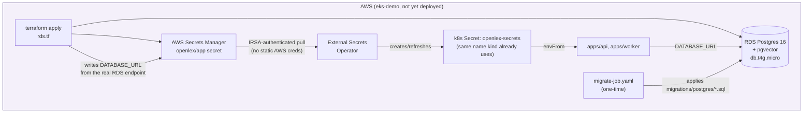
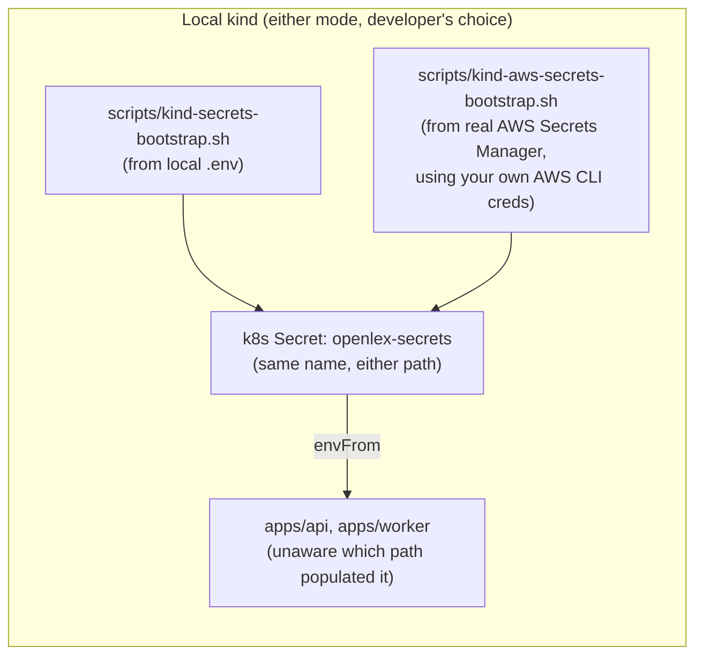

# Phase 7 — AWS RDS + Secrets Manager + External Secrets — Design

**Status:** approved design, pending implementation plan
**GA checklist:** `docs/superpowers/plans/2026-07-12-ga-readiness-checklist.md`'s Phase 7
(7.1–7.5)
**Builds on:** the existing (never live-verified) `eks-demo` scaffolding —
`infra/terraform/{eks,vpc,iam_irsa_external_secrets,security_groups}.tf`,
`infra/argocd/apps/eks-demo/{secretstore-aws,app-external-secrets,argocd-admin-externalsecret}.yaml`,
`infra/kubernetes/overlays/eks-demo/externalsecret-openlex.yaml` — and the local kind
bootstrap-script convention (`scripts/kind-secrets-bootstrap.sh`).

## Goal

Phase 6 deliberately kept CI/CD AWS-free (GHCR, not ECR) to close out CI/CD essentials without
a real-money dependency. Phase 7 is the actual cloud-production path this project's
`eks-demo` scaffolding was always aimed at, but never finished: a managed database (the
in-cluster Postgres `StatefulSet` has no backup/DR story at all today), and completing/
verifying the Secrets Manager + External Secrets Operator integration that already exists in
manifest form but has never actually run.

**Explicitly in scope:** RDS Postgres for the eks-demo/production path (7.1), verifying and
completing the existing Secrets Manager + External Secrets Operator manifests (7.2), an
explicit opt-in path for local kind to use real AWS Secrets Manager/RDS instead of local
`.env`/in-cluster Postgres (7.3), Terraform remote state (7.4, closes the old 6.4), and a
Postgres backup/DR strategy (7.5, closes the old 6.5).

**Explicitly out of scope:** actually running `terraform apply` against a real AWS account, or
any other live AWS deployment/verification — confirmed with the user: this phase produces
real, complete, `terraform validate`-clean infrastructure-as-code and manifests, ready to
deploy whenever a live EKS demo is actually wanted, not a live deployment itself. No changes
to `docker-compose.yml` or the `develop`/kind GitOps pipeline from Phase 6 — those stay
exactly as they are; this phase only touches the `eks-demo` overlay/Terraform and adds a new,
separate, opt-in local bootstrap path.

## 7.1 — RDS Postgres

**Problem:** `infra/terraform/` has no RDS resource of any kind today — the in-cluster
Postgres `StatefulSet` (`infra/kubernetes/base/postgres/`) is the only database this project
has ever had, on either kind or the (never-deployed) eks-demo path. It has no automated
backups, no managed failover, no serious DR story.

**Design:**

- New `infra/terraform/rds.tf`: a single `aws_db_instance`, engine `postgres`, version `16`
  (matching local dev's `pgvector/pgvector:pg16` exactly), instance class `db.t4g.micro`
  (Graviton, matching this repo's existing cost-conscious node-type precedent in
  `variables.tf`'s `node_instance_type`), `storage_type = "gp3"`, `allocated_storage = 20`
  (GB — pgvector's HNSW index plus this project's actual corpus size, low tens of MB today,
  leaves enormous headroom at 20GB; a defensible starting default, not a measured optimum).
- **Subnet placement — corrects an assumption from initial discussion:** `infra/terraform/
  vpc.tf` is deliberately public-subnets-only (`private_subnets = []`, no NAT Gateway, to
  avoid its ~$32+/mo cost — see the file's own comment and `docs/infrastructure/
  aws-eks-cost-estimate.md`). RDS does **not** get its own new private subnet group — it
  joins the existing public subnets via a `aws_db_subnet_group`, exactly like the EKS nodes
  do, with `publicly_accessible = false` and a dedicated security group as the actual
  isolation boundary (allowing inbound `5432` only from the EKS cluster's own node security
  group) — not subnet-level isolation. This matches the VPC's existing security model:
  public subnets, tight security groups, no NAT Gateway, rather than introducing a
  fundamentally different (and cost-additive) networking pattern for one resource.
- **Secrets Manager wiring — closes an existing manual-step gap:** `infra/terraform/README.md`
  step 5 currently says to create the `openlex/app` Secrets Manager secret by hand. `rds.tf`
  instead writes `DATABASE_URL` (built from the real `aws_db_instance` endpoint + generated
  credentials) directly into that secret via `aws_secretsmanager_secret` +
  `aws_secretsmanager_secret_version` (using `random_password` for the DB password, never
  hardcoded) — the *other* keys `openlex/app` needs (`ANTHROPIC_API_KEY`,
  `NY_OPEN_LEG_API_KEY`, `JWT_SECRET_KEY`, `DEMO_*`) stay manually created, since those are
  genuinely external credentials Terraform has no business generating. This is a real,
  bounded improvement over today's fully-manual step, not a full rewrite of it.
- **Migrations:** RDS has no `docker-entrypoint-initdb.d` equivalent (unlike the local
  `postgres` `StatefulSet`, which mounts `migrations/postgres/` directly). New one-time k8s
  `Job` manifest (`infra/kubernetes/overlays/eks-demo/migrate-job.yaml`) running the same
  `migrations/postgres/*.sql` files against the RDS endpoint via `psql` — mirrors
  `integration.yml`'s CI migration-apply loop (Phase 6) rather than inventing a new mechanism.

## 7.2 — Secrets Manager + External Secrets Operator: verify and complete

**Problem:** `ClusterSecretStore` (`secretstore-aws.yaml`), `ExternalSecret`
(`externalsecret-openlex.yaml`, `argocd-admin-externalsecret.yaml`), and the IRSA role
(`iam_irsa_external_secrets.tf`) already exist and, on inspection, are internally
consistent (the IRSA trust policy's `StringEquals` condition on
`system:serviceaccount:external-secrets:external-secrets` matches
`app-external-secrets.yaml`'s pinned `serviceAccount.name`; the `secrets_manager_path_prefix`
scoping matches the `openlex/*` secret paths actually referenced) — but none of this has ever
run against a real cluster, per this project's own "check before assuming" convention
(`CLAUDE.md`).

**Design:** since this phase doesn't deploy live (see "Explicitly out of scope"),
verification here means:

- A careful manual cross-check of every file in this chain against External Secrets
  Operator's actual documented CRD schema (`ClusterSecretStore`/`ExternalSecret` `apiVersion`/
  `spec` shape, specifically for `v1beta1` and the `aws`/`SecretsManager` provider block) —
  catching anything that would only surface as a runtime CRD-validation error.
  `externalsecret-openlex.yaml`'s `dataFrom.extract` shape (pull every key from one JSON
  secret) needs updating to also cover 7.1's new `DATABASE_URL` key once `rds.tf` writes it
  (should be automatic, since `dataFrom.extract` pulls the whole secret rather than
  naming keys individually — verify this assumption explicitly, don't just assert it).
- Confirming `README.md`'s step 4 (`terraform output external_secrets_role_arn`
  hand-copied into `app-external-secrets.yaml`'s ServiceAccount annotation) is accurately
  documented and the placeholder (`<EXTERNAL_SECRETS_ROLE_ARN>`) is unambiguous.
- No functional/behavioral changes expected here — this is a review-and-document pass, not
  new infrastructure, unless the review finds a real bug (in which case, fix it, and note it
  explicitly as "found during verification," not silently).

## 7.3 — Local AWS-backed bootstrap option

**Problem:** the only way to run this project locally today is kind + local Postgres + a
plain `.env`-derived k8s Secret. There's no way to point local kind at real AWS Secrets
Manager/RDS for a developer who wants to test against real cloud resources without standing
up all of eks-demo.

**Design:** kind has no IRSA (that's an EKS-only OIDC-federation feature — `scripts/
kind-secrets-bootstrap.sh`'s own comment already documents this as the reason kind can't use
External Secrets Operator). Rather than installing ESO on kind with a less-rotatable static
IAM credential (rejected — adds an operator plus a standing AWS credential to a local
cluster for no real benefit), this extends the *existing* bootstrap-script pattern:

- New `scripts/kind-aws-secrets-bootstrap.sh`, sibling to `kind-secrets-bootstrap.sh`: uses
  the developer's own local AWS CLI credentials (`~/.aws/credentials` or environment
  variables — never stored in this repo, never touching `.env`) to call
  `aws secretsmanager get-secret-value --secret-id openlex/app`, then creates/updates the
  **same** `openlex-secrets` k8s Secret name via `kubectl create secret generic ... --dry-run
  =client -o yaml | kubectl apply -f -` — identical idempotent pattern, identical target
  Secret name, so `infra/kubernetes/base/{api,worker}`'s `envFrom` doesn't need to know or
  care which bootstrap script populated it.
- "Opting in" is simply: run `kind-aws-secrets-bootstrap.sh` instead of
  `kind-secrets-bootstrap.sh`. No new kustomize overlay, no flag, no prompt — one is the
  local-only path, the other is the AWS-backed path, and a developer picks by which script
  they run. `apps/api`/`apps/worker` never know or care which one populated `openlex-secrets`
  or what `DATABASE_URL` actually points to.
- The local kind Postgres `StatefulSet` keeps running either way (not worth a new overlay
  variant just to omit one idle pod) — in AWS-backed mode, it simply goes unused once
  `DATABASE_URL` points at the real RDS endpoint instead.
- `COURTLISTENER_API_TOKEN`-style framing applies here too: `kind-aws-secrets-bootstrap.sh`
  is a one-time-per-session bootstrap convenience, never wired into
  `openlex_shared.config.Settings` or any runtime code path.

## 7.4 — Terraform remote state

**Problem:** `infra/terraform/backend.tf` has a commented-out S3 backend block, documented as
"upgrade once more than one person/machine touches this" — true today for a solo project, but
this phase closes the gap so it's ready.

**Design:** uncomment and parameterize the existing block (bucket/key/region/table already
sketched, just need real values via `terraform.tfvars` or a small separate bootstrap). Since
an S3 bucket + DynamoDB table can't be created by the same Terraform config that needs them to
exist first (the classic remote-state chicken-and-egg), document (not automate) a one-time
`aws s3api create-bucket` + `aws dynamodb create-table` bootstrap sequence in
`infra/terraform/README.md`, then `terraform init -migrate-state` to move existing local state
across. No new `.tf` file needed beyond uncommenting `backend.tf` — the bootstrap commands are
documentation, matching this project's existing precedent of keeping one-time infra bootstrap
as documented manual steps (e.g. the Route53 nameserver step) rather than self-referential
Terraform.

## 7.5 — Backup/DR

**Design:** resolved almost entirely by 7.1's `aws_db_instance` configuration —
`backup_retention_period = 7` (days), a `backup_window` set to a low-traffic UTC hour, and
`aws_db_instance.final_snapshot_identifier` set (so a future `terraform destroy` doesn't
silently discard the final state). Documented in `infra/terraform/README.md` as the actual DR
strategy: RDS's own automated daily snapshots, not a custom `pg_dump`-to-S3 pipeline — simpler
and free (included in RDS pricing up to the allocated storage size).

## Testing (no live deployment this phase — see "Explicitly out of scope")

- `terraform validate` and `terraform fmt -check` on the full `infra/terraform/` directory
  after every new/changed `.tf` file.
- `terraform plan` against the *existing* local-state backend (not yet migrated to S3) to
  confirm the plan is coherent (correct resource count, no unexpected destroys of existing
  `eks.tf`/`vpc.tf` resources) — this can run without any state migration, since local state
  already reflects "nothing deployed yet."
- Manual schema cross-check of every new/touched k8s manifest (`migrate-job.yaml`, any
  `ExternalSecret` changes) against the relevant CRD's actual documented `apiVersion`/`spec`
  shape — cite the specific doc/schema version checked against in the implementation plan's
  task reports, not just "looks right."
- `scripts/kind-aws-secrets-bootstrap.sh` **can** be tested live against real AWS Secrets
  Manager without needing EKS/RDS to exist — it only needs a real `openlex/app` secret to
  read from. If a real AWS Secrets Manager secret is available for testing, this script's
  actual behavior (idempotent create/update of `openlex-secrets`, matching
  `kind-secrets-bootstrap.sh`'s exact pattern) should be verified live against the real kind
  cluster, same as every other bootstrap script in this project's history — this is the one
  piece of this phase that can be genuinely live-verified without any AWS spend beyond
  Secrets Manager's near-zero per-secret cost.

## Open questions / risks

- **RDS cost, once actually deployed:** `db.t4g.micro` + 20GB gp3 + 7-day backups is roughly
  $12-18/mo (single-AZ, no read replica) — small relative to EKS's own $73/mo control-plane
  fee, but real once `terraform apply` runs. Not a concern for this phase (no live deploy),
  worth restating in `docs/infrastructure/aws-eks-cost-estimate.md` once this lands.
- **pgvector version compatibility:** RDS Postgres 16 supports the `vector` extension, but the
  exact minor-version cutoff and available pgvector version should be double-checked against
  AWS's current supported-extensions documentation at implementation time (RDS's supported
  extension versions lag upstream pgvector releases and change over time) — not something to
  hardcode into the design as a permanent fact.
- **`aws_secretsmanager_secret_version` and Terraform state:** writing a real (generated)
  database password into Terraform state means that state file itself becomes sensitive —
  directly motivates 7.4 (remote state, ideally with S3 bucket encryption + restricted IAM
  access) landing *before* or *alongside* 7.1, not as a purely independent follow-up.
